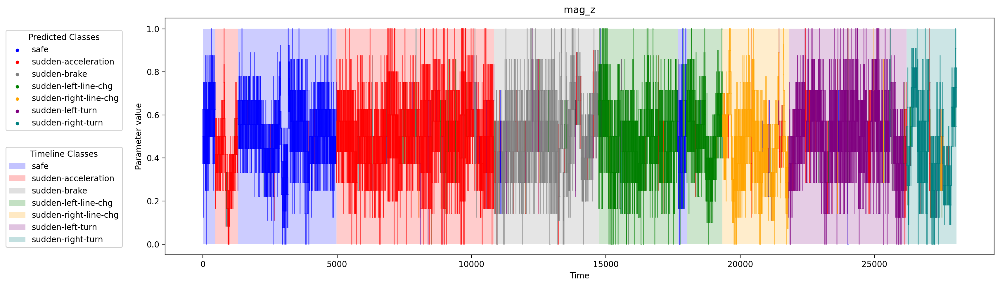

# ENEL 645 - Final Project : Harsh driving detection

## Armin Ghayur Sadigh - Ranuki Hettiarachchige

---

### Introduction

In this project, we attempt to develop a model which can classify driving behavior. This model will be able to tell whether current driving is safe or dangerous using accelerometer, gyroscope, and magnetometer measurements alongside 3 major axis (x, y, and z).

### Methodology

We use an LSTM model to classify data sequences and predict the driving behavior type. This includes 1 safe class and 6 harsh classes.

### Results

#### Predictive performance metrics

| Dataset    | Accuracy | AUC   | F1 Score |
| ---------- | -------- | ----- | -------- |
| Training   | 100%     | 1.000 | 1.000    |
| Validation | 89.446%  | 0.985 | 0.895    |
| Testing    | 83.947%  | 0.974 | 0.839    |

#### Sample outputs

Results of classifying the whole dataset can be seen below. Timeline color indicates the true class while graph color indicates model output at that point in time.

##### Accelerometer data

##### Gyroscope data

##### Magnetometer data

